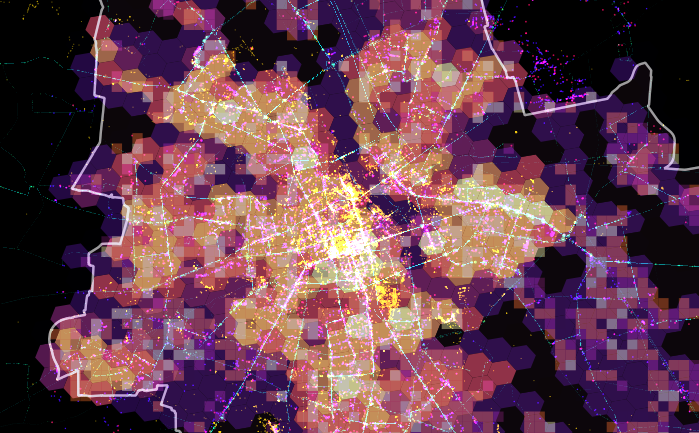

# Urban Unraveler
This set of tools aims to help in choosing the optimal location within a given urban area. The tool is especially aimed at real-estate developers to better understand cities and their dynamics. 

Urban Unraveler aims to be scalable and universal. 
 

## Installation instructions
    pip install -r requirements.txt

### Prerequisites

#### Setting up the PostGIS database
[PostGIS database.](https://postgis.net/)

## Urban Unraveler under the hood
Urban Unraveler uses the [H3 indexing system](https://github.com/uber/h3) to create an uniform way to aggregate different datasets together. 

### Datasets 

#### OpenStreetMap

#### GTFS data
https://transitfeeds.com/

